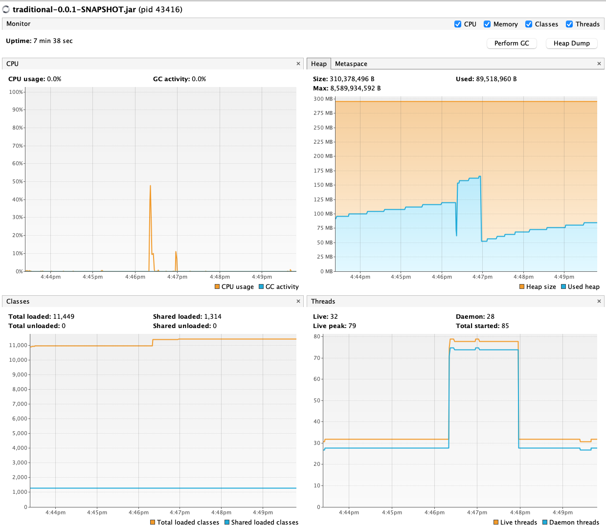
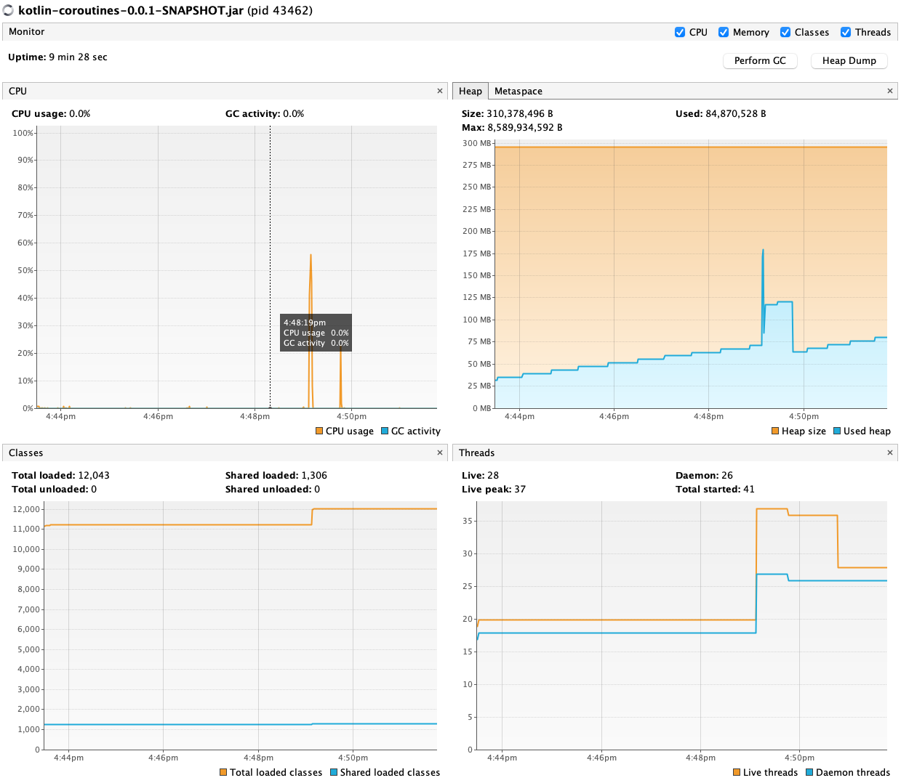
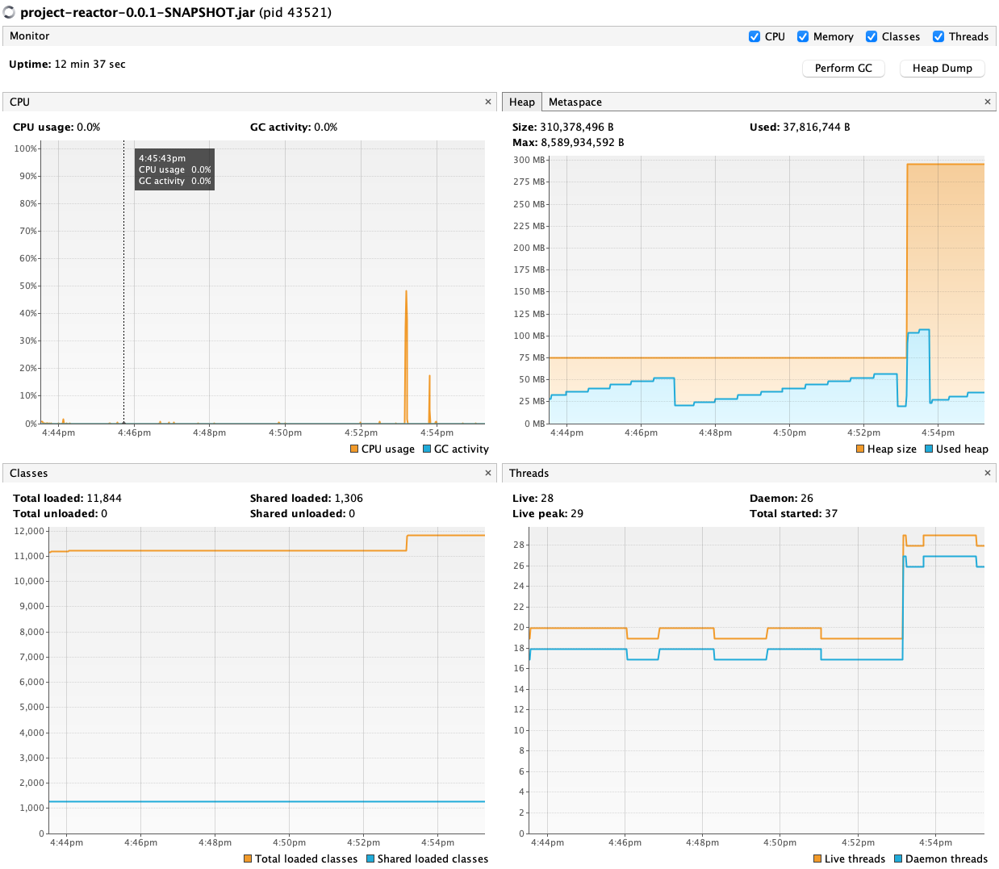

# kotlin-springboot-reactive-resource-usage

A quick comparison of spring boot resource usage with reactive vs traditional methods.

This experiment is very contrived - the difference between the three examples below is just
the threading behaviour at the web request handling layer. Your results will differ if you 
introduce more sophisticated underlying IO operations, but in general the following results are shown:

- Traditional MVC used a lot of threads, Coroutines about half as much and Reactor even less.
- Traditional MVC used the most heap, Coroutines less, and Reactor even less.

Some thoughts following from this:

- If cost of computing resources is your goal then choose Reactor, but at the expense of imperative coding styles.
- Coroutines give definite memory & threading advantages over MVC without changing coding styles.

### Method

1. Install some java resource monitoring tool, e.g.: `sdk install visualvm`
2. Start up the monitoring tool.
3. Start a backing database, e.g.: `docker run -e POSTGRES_USER=postgres -e POSTGRES_PASSWORD=postgres -e POSTGRES_DB=db -p 5432:5432 -d postgres:16`
4. Build all subprojects: `.gradlew assemble`

#### Traditional MVC

1. Run: `java -jar ./traditional/build/libs/traditional-0.0.1-SNAPSHOT.jar`
2. Attach the monitoring tool to the JVM process.

#### Reactive (Kotlin coroutines)

1. Run: `java -jar ./kotlin-coroutines/build/libs/kotlin-coroutines-0.0.1-SNAPSHOT.jar`
2. Attach the monitoring tool to the JVM process.

#### Reactive (Project Reactor)

1. Run: `java -jar ./project-reactor/build/libs/project-reactor-0.0.1-SNAPSHOT.jar`
2. Attach the monitoring tool to the JVM process.

#### Testing

1. Start load testing, e.g.: 
   - `ab -n 20000 -c 50 -s 60 http://localhost:8080/api/nextval`
   - `ab -n 20000 -c 50 -s 60 http://localhost:8081/api/nextval`
   - `ab -n 20000 -c 50 -s 60 http://localhost:8082/api/nextval`
2. Results, e.g.:


##### Traditional

```bash
ab -n 20000 -c 50 -s 60 http://localhost:8080/api/nextval
This is ApacheBench, Version 2.3 <$Revision: 1903618 $>
Copyright 1996 Adam Twiss, Zeus Technology Ltd, http://www.zeustech.net/
Licensed to The Apache Software Foundation, http://www.apache.org/

Benchmarking localhost (be patient)
Completed 2000 requests
Completed 4000 requests
Completed 6000 requests
Completed 8000 requests
Completed 10000 requests
Completed 12000 requests
Completed 14000 requests
Completed 16000 requests
Completed 18000 requests
Completed 20000 requests
Finished 20000 requests


Server Software:        
Server Hostname:        localhost
Server Port:            8080

Document Path:          /api/nextval
Document Length:        17 bytes

Concurrency Level:      50
Time taken for tests:   37.765 seconds
Complete requests:      20000
Failed requests:        2762
(Connect: 0, Receive: 0, Length: 2762, Exceptions: 0)
Total transferred:      2442762 bytes
HTML transferred:       342762 bytes
Requests per second:    529.59 [#/sec] (mean)
Time per request:       94.413 [ms] (mean)
Time per request:       1.888 [ms] (mean, across all concurrent requests)
Transfer rate:          63.17 [Kbytes/sec] received

Connection Times (ms)
min  mean[+/-sd] median   max
Connect:        0   88 1748.4      0   35013
Processing:     0    6  10.5      4     246
Waiting:        0    6  10.1      3     244
Total:          1   94 1749.8      4   35053

Percentage of the requests served within a certain time (ms)
50%      4
66%      5
75%      7
80%      8
90%     12
95%     17
98%     28
99%     41
100%  35053 (longest request)
```


#### Kotlin coroutines

```bash
ab -n 20000 -c 50 -s 60 http://localhost:8081/api/nextval
This is ApacheBench, Version 2.3 <$Revision: 1903618 $>
Copyright 1996 Adam Twiss, Zeus Technology Ltd, http://www.zeustech.net/
Licensed to The Apache Software Foundation, http://www.apache.org/

Benchmarking localhost (be patient)
Completed 2000 requests
Completed 4000 requests
Completed 6000 requests
Completed 8000 requests
Completed 10000 requests
Completed 12000 requests
Completed 14000 requests
Completed 16000 requests
Completed 18000 requests
Completed 20000 requests
Finished 20000 requests


Server Software:        
Server Hostname:        localhost
Server Port:            8081

Document Path:          /api/nextval
Document Length:        18 bytes

Concurrency Level:      50
Time taken for tests:   38.459 seconds
Complete requests:      20000
Failed requests:        0
Total transferred:      1780000 bytes
HTML transferred:       360000 bytes
Requests per second:    520.04 [#/sec] (mean)
Time per request:       96.146 [ms] (mean)
Time per request:       1.923 [ms] (mean, across all concurrent requests)
Transfer rate:          45.20 [Kbytes/sec] received

Connection Times (ms)
              min  mean[+/-sd] median   max
Connect:        0   88 1748.2      0   35017
Processing:     1    8   6.6      6     334
Waiting:        1    7   6.6      6     331
Total:          1   95 1749.5      6   35050

Percentage of the requests served within a certain time (ms)
  50%      6
  66%      7
  75%      8
  80%      9
  90%     12
  95%     14
  98%     20
  99%     37
 100%  35050 (longest request)
```



#### Project reactor

```bash
ab -n 20000 -c 50 -s 60 http://localhost:8082/api/nextval
This is ApacheBench, Version 2.3 <$Revision: 1903618 $>
Copyright 1996 Adam Twiss, Zeus Technology Ltd, http://www.zeustech.net/
Licensed to The Apache Software Foundation, http://www.apache.org/

Benchmarking localhost (be patient)
Completed 2000 requests
Completed 4000 requests
Completed 6000 requests
Completed 8000 requests
Completed 10000 requests
Completed 12000 requests
Completed 14000 requests
Completed 16000 requests
Completed 18000 requests
Completed 20000 requests
Finished 20000 requests


Server Software:        
Server Hostname:        localhost
Server Port:            8082

Document Path:          /api/nextval
Document Length:        18 bytes

Concurrency Level:      50
Time taken for tests:   38.206 seconds
Complete requests:      20000
Failed requests:        0
Total transferred:      1780000 bytes
HTML transferred:       360000 bytes
Requests per second:    523.48 [#/sec] (mean)
Time per request:       95.515 [ms] (mean)
Time per request:       1.910 [ms] (mean, across all concurrent requests)
Transfer rate:          45.50 [Kbytes/sec] received

Connection Times (ms)
              min  mean[+/-sd] median   max
Connect:        0   88 1748.3      0   35012
Processing:     1    7  11.2      5     361
Waiting:        0    7  11.2      5     359
Total:          1   95 1749.0      5   35041

Percentage of the requests served within a certain time (ms)
  50%      5
  66%      6
  75%      6
  80%      7
  90%     10
  95%     13
  98%     19
  99%     35
 100%  35041 (longest request)
```


